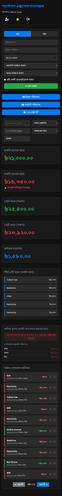
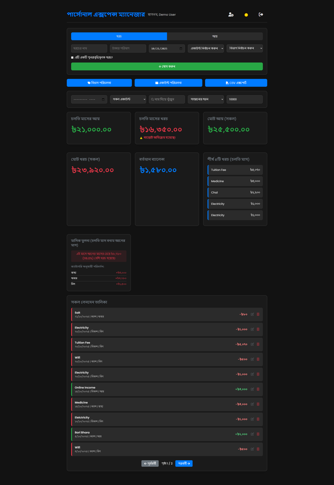

# 💰 AmarHishab (আমারহিসাব) — Smart Personal Finance & Khata Manager

<div align="center">


### আপনার দৈনন্দিন আয়-ব্যয়, দেনা-পাওনা ও ডিজিটাল হিসাবের পূর্ণাঙ্গ প্ল্যাটফর্ম
**All-in-One Smart Personal Finance, Expense Tracker & Digital Customer Khata for Web & Android**

[](https://amarhishab.web.app/)
[](https://github.com/lurek/AmarHishab/releases/latest/download/AmarHishab-Release.apk)

[](https://github.com/lurek/AmarHishab/releases)
[](https://github.com/lurek/AmarHishab/actions)
[](https://amarhishab.web.app/)
[](LICENSE)
[](https://capacitorjs.com/)

[**🌐 Live Website**](https://amarhishab.web.app/) • [**📥 Download APK**](https://github.com/lurek/AmarHishab/releases/latest/download/AmarHishab-Release.apk) • [**✨ Features**](#-key-features) • [**🇧🇩 বাংলা বিবরণ**](#-বাংলা-বিবরণ-ও-ব্যবহার-নির্দেশিকা) • [**⚖️ License & Attribution**](#️-license-copyright--terms-of-use)

</div>

---

## 📱 Visual Showcase / এক নজরে অ্যাপ ইন্টারফেস

<div align="center">
  <table>
    <tr>
      <td align="center" width="50%">
        <b>📱 Mobile View (অ্যান্ড্রয়েড অ্যাপ ও মোবাইল স্ক্রিন)</b><br><br>
        
      </td>
      <td align="center" width="50%">
        <b>💻 Desktop View (ওয়েব ড্যাশবোর্ড)</b><br><br>
        
      </td>
    </tr>
  </table>
</div>

---

## 💡 About AmarHishab / আমারহিসাব পরিচিতি

**AmarHishab (আমারহিসাব)** is an intuitive, fast, and feature-rich fintech web and mobile application developed to simplify personal bookkeeping, business transaction tracking, and debt management for Bengali and international users. 

From smart bKash/Nagad/Bank SMS auto-parsing to multi-channel customer voucher slips (WhatsApp, SMS, Email) and 30-day recycle bin safety, AmarHishab blends modern fintech elegance with powerful offline-ready Capacitor Android capabilities.

- 🌐 **Official Web App**: [https://amarhishab.web.app/](https://amarhishab.web.app/)
- 📱 **Official Android Release**: [Download AmarHishab-Release.apk](https://github.com/lurek/AmarHishab/releases/latest/download/AmarHishab-Release.apk)
- 👨‍💻 **Architect & Developer**: [MD. Tanvir Ahamed Siddike](https://github.com/lurek)

---

## ✨ Key Features

### 1. 🤝 Lend / Borrow Management with Digital Contacts (দেনা-পাওনা খাতা)
- **Optional Contact Book Integration**: Save customer/borrower/lender phone number, WhatsApp number, email address, and loan payback due date.
- **Smart Due Date Badges**: Instant visual flags for:
  - 🟡 *আজ ফেরত দিতে হবে (Due Today)*
  - 🔵 *X দিন বাকি (X Days Left)*
  - 🔴 *মেয়াদ শেষ (Overdue Alert)*
- **Customer Statement PDF (খতিয়ান PDF)**: Generate and download printable, beautifully styled PDF ledger statements of individual customer transaction history at any time.

### 2. 📩 Multi-Channel Digital Voucher Slips & Reminders
- **Instant Bottom Action Sheet**: Triggered automatically after recording debt transactions.
- **WhatsApp Voucher**: Opens `wa.me` directly with pre-formatted polite Bengali transaction slip detailing transaction type, amount, date, net balance, and repayment instructions.
- **Dual-Mode SMS**:
  - *Device SIM (100% Free)*: Uses the phone's native SMS app without requiring third-party API keys or balance charges.
  - *Cloud SMS API (Optional)*: Configure your favorite custom SMS gateway in Settings.
- **Email Vouchers**: Automated transactional emails via EmailJS.
- **bKash / Nagad Payment Collection**: Embed your bKash or Nagad personal number into reminder messages with one click.

### 3. 🗑️ 30-Day Trash / Recycle Bin (রিসাইকেল বিন)
- **Accidental Deletion Protection**: Deleted expenses, incomes, recurring entries, or debt ledgers are never immediately lost.
- **30-Day Expiry Guarantee**: Items are safely quarantined in the user's private `trash` collection for 30 days.
- **1-Click Full Restore**: Restores records back into active ledgers, keeping complete subcollection transaction history intact and recalculating live account balances.
- **Permanent Purge & Empty Bin**: Users can permanently shred specific items or flush the entire recycle bin on demand.

### 4. 💳 Account Transfer (একাউন্ট স্থানান্তর)
- Move money seamlessly between cash, bKash, Nagad, Rocket, or Bank accounts without skewing monthly income/expense analytics.

### 5. 📱 Smart SMS Parser (bKash, Nagad & Bank Transaction Auto-Detector)
- Simply paste transaction SMS received from bKash, Nagad, Rocket, or Banks.
- AmarHishab instantly detects transaction type (Debit/Expense vs. Credit/Income), counterparty/merchant/TrxID, and exact numeric amount.

### 6. 👁️ Privacy Eye Toggle (গোপনীয়তা মোড)
- Hide or reveal total balances and sensitive cash figures with a single tap in public transit or shared spaces. Retains state in local storage.

### 7. 🎨 Next-Gen Fintech UI & Mobile Polish
- Glassmorphism balance cards, quick-filter chips (+100, +500, +1000, +5000), dark/light mode toggle.
- **Android Notch / Punch-hole Support**: Tailored viewport safe-area insets prevent camera cutout clipping.
- **Capacitor Hardware Back-Button Support**: Closes nested modals first, switches tabs to Home second, and gracefully exits only from Home.
- **In-Place App Updates**: Standardized release keystore configuration allows seamless in-place APK updates without uninstalling previous versions.

---

## 🇧🇩 বাংলা বিবরণ ও ব্যবহার নির্দেশিকা

**আমারহিসাব (AmarHishab)** আপনার ব্যক্তিগত ও ব্যবসায়িক আয়-ব্যয়ের হিসাবকে সহজ, ডিজিটাল এবং সুরক্ষিত রাখার এক অনন্য মাধ্যম। খাতা-কলমের ঝামেলা বাদ দিয়ে মোবাইল ও কম্পিউটারে খুব সহজেই আপনার দৈনন্দিন হিসাব পরিচালনা করুন।

### 🌟 প্রধান সুবিধাসমূহ:
1. **দেনা-পাওনা ও কাস্টমার খতিয়ান (TallyKhata / Khatabook স্টাইল)**:
   - কার কাছে কত টাকা পাবেন বা কে কত পাবে তার নিখুঁত হিসাব।
   - গ্রাহকের মোবাইল, হোয়াটসঅ্যাপ, ইমেইল এবং ফেরত দেওয়ার তারিখ সংরক্ষণ।
   - **খতিয়ান PDF**: এক ক্লিকেই গ্রাহকের সম্পূর্ণ হিসাবের প্রিন্টযোগ্য PDF খতিয়ান ডাউনলোড।
2. **ডিজিটাল ভাউচার ও তাগাদা নোটিফিকেশন**:
   - লেনদেনের সাথে সাথে গ্রাহকের হোয়াটসঅ্যাপ বা মোবাইলে ফ্রি এসএমএস-এ ডিজিটাল ভাউচার স্লিপ পাঠানোর সুবিধা।
   - সেটিংসে আপনার বিকাশ বা নগদ নম্বর সেট করে রাখলে তাগাদা মেসেজে স্বয়ংক্রিয়ভাবে পেমেন্ট লিংক ও নম্বর যুক্ত হয়ে যায়।
3. **৩০ দিনের রিসাইকেল বিন (Trash System)**:
   - ভুলবশত কোনো লেনদেন বা কাস্টমারের হিসাব মুছে ফেললেও কোনো চিন্তা নেই! এটি ৩০ দিন পর্যন্ত রিসাইকেল বিনে সুরক্ষিত থাকে এবং ১-ক্লিকেই যাবতীয় পূর্বের হিস্ট্রি সহ ফেরত আনা যায়।
4. **স্মার্ট এসএমএস পার্সার**:
   - বিকাশ, নগদ বা ব্যাংকের এসএমএস কপি করে পেস্ট করলেই স্বয়ংক্রিয়ভাবে টাকা ও লেনদেনের বিবরণ ফর্ম-এ বসে যায়।
5. **ব্যালেন্স হাইড/শো সুবিধা**:
   - রাস্তায় বা পাবলিক প্লেসে হিসাব দেখার সময় গোপনীয়তা রক্ষার্থে চোখের আইকনে (👁️) চাপ দিয়ে ব্যালেন্স লুকিয়ে রাখা যায়।
6. **অ্যান্ড্রয়েড অ্যাপ ও লাইভ ওয়েবসাইট**:
   - আপনার পছন্দের যেকোনো ব্রাউজারে ব্যবহার করুন: [https://amarhishab.web.app/](https://amarhishab.web.app/)
   - অথবা ফোনে ইন্সটল করুন অ্যান্ড্রয়েড অ্যাপ: [AmarHishab-Release.apk](https://github.com/lurek/AmarHishab/releases/latest/download/AmarHishab-Release.apk)

---

## 🛠️ Tech Stack & Architecture

| Component | Technologies Used |
|---|---|
| **Frontend UI/UX** | Semantic HTML5, CSS3 Custom Properties, Modern Glassmorphism, Font Awesome 6 |
| **Client Engine** | Vanilla JavaScript (ES6+), PWA Service Worker (`sw.js`), jsPDF, jsPDF-AutoTable |
| **Backend & Cloud** | Google Firebase Authentication, Cloud Firestore (Realtime NoSQL Database), Firebase Hosting |
| **Mobile Runtime** | Capacitor 8 (`@capacitor/android`, `@capacitor/app`, `@capacitor/haptics`) |
| **CI / CD Pipeline** | GitHub Actions (Ubuntu 24.04, Node.js 22 LTS, Java JDK 17, Gradle Release Build) |

---

## 🚀 Getting Started & Local Development

### Prerequisites
- [Node.js](https://nodejs.org/) (Version >= 22.0.0 required for Capacitor 8)
- Java JDK 17 & Android SDK (if building APK locally; or use GitHub Actions for zero-setup cloud build)
- Firebase CLI (`npm install -g firebase-tools`)

### Installation
```bash
# 1. Clone the repository
git clone https://github.com/lurek/AmarHishab.git
cd AmarHishab

# 2. Install dependencies
npm install

# 3. Serve locally
npx serve public/
# Or use Firebase emulator / live server
```

### Android Sync
```bash
npx cap sync android
```

---

## ☁️ Continuous Deployment & Automated Builds

- **Android APK Build**: Automated on every push to `main` branch via [.github/workflows/build-apk.yml](.github/workflows/build-apk.yml). Releases are published directly to GitHub Releases with a static download link:
  `https://github.com/lurek/AmarHishab/releases/latest/download/AmarHishab-Release.apk`
- **Firebase Hosting Auto-Deploy**: Managed via [.github/workflows/firebase-deploy.yml](.github/workflows/firebase-deploy.yml). Deploys `public/` directory to `amarhishab.web.app` automatically on merge.

---

## ⚖️ License, Copyright & Terms of Use / স্বত্বাধিকার ও লাইসেন্স নীতি

**Copyright (c) 2026 MD. Tanvir Ahamed Siddike. All Rights Reserved.**

This project is licensed under the **GNU General Public License v3.0 (GPLv3)** with **Mandatory Attribution & Name Protection Addendum**:

### 🛡️ Attribution & Anti-Plagiarism Notice:
1. **Mandatory Credit & Attribution**: Any person or organization who copies, forks, modifies, redistributes, or publicly deploys this software (or substantial portions thereof) **MUST preserve prominent and legible attribution** to the original author:
   - **Author**: **MD. Tanvir Ahamed Siddike**
   - **GitHub**: [https://github.com/lurek](https://github.com/lurek)
   - **Profile**: [https://facebook.com/tanviras615](https://facebook.com/tanviras615)
   - **Repository**: [https://github.com/lurek/AmarHishab](https://github.com/lurek/AmarHishab)
2. **No Rebranding / Name Removal**: You may **NOT** remove, hide, or alter the developer credit section in the application settings, UI footer, about dialogs, or source code comments without explicit prior written authorization from the author.
3. **Open Source Reciprocity**: If you modify and distribute this software, your modified source code must also be made publicly available under the terms of GPLv3.

---

## 👨‍💻 Developer & Maintainer

<table border="0">
  <tr>
    <td align="center" width="120">
      <br>
      <b>MD. Tanvir Ahamed Siddike</b>
    </td>
    <td>
      <ul>
        <li><b>GitHub:</b> <a href="https://github.com/lurek">@lurek</a></li>
        <li><b>Facebook:</b> <a href="https://facebook.com/tanviras615">MD. Tanvir Ahamed Siddike</a></li>
        <li><b>Email:</b> <a href="mailto:lurek615@gmail.com">lurek615@gmail.com</a></li>
        <li><b>Web App:</b> <a href="https://amarhishab.web.app/">amarhishab.web.app</a></li>
        <li><b>Role:</b> Founder & Lead Software Engineer</li>
      </ul>
    </td>
  </tr>
</table>

<div align="center">
  <sub>Made with ❤️ in Bangladesh for seamless personal finance management.</sub>
</div>
